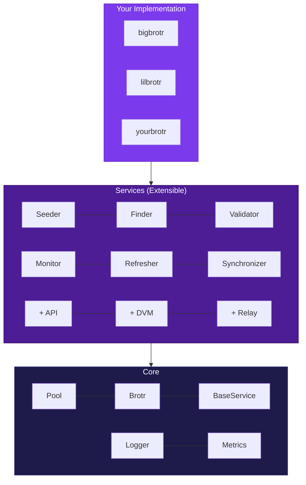

# BigBrotr

Network Intelligence for Nostr

<div class="abs-bl m-6 text-sm opacity-50">
  Open Source · MIT License · Python + PostgreSQL
</div>

---
layout: center
---

# How do you get a global view of a distributed network?

---

# The Challenge

<v-clicks>

- Events are scattered across **hundreds of independent relays**
- Each relay is ephemeral — can disappear at any time
- No single entity sees the whole picture
- Unreplicated events are **lost forever**

</v-clicks>

---

# What is BigBrotr?

<div class="grid grid-cols-2 gap-8">

<div>

## Core Infrastructure

<v-clicks>

- Network observatory for Nostr
- Time machine for relay history
- Research platform for protocol analysis
- Testbench for developers

</v-clicks>

</div>

<div>

## Extensible To

<v-clicks>

- Run a Relay on top
- Build a Trust Authority (NIP-85)
- Deploy Data Vending Machines
- Expose REST/GraphQL APIs

</v-clicks>

</div>

</div>

---

# Architecture: Diamond DAG

Five packages, one rule: **imports only flow downward.**

```
                services           Orchestration
               /   |   \
            core  nips  utils      Infrastructure
               \   |   /
                models             Pure domain types
```

<v-clicks>

- **models** — Frozen dataclasses, zero I/O, fail-fast validation
- **core** — Pool, Brotr (DB facade), BaseService, Logger, Metrics
- **nips** — NIP-11 relay info, NIP-66 health monitoring (6 tests)
- **utils** — DNS, Nostr keys, WebSocket/HTTP transport, SOCKS5
- **services** — Six independent services sharing PostgreSQL

</v-clicks>

---

# Customizable Layer Architecture

<div class="text-center">



</div>

---
layout: two-cols
layoutClass: gap-8
---

# Six Independent Services

All services run independently, connected **only through the database**.

No message queues. No inter-service APIs.

Each service:
- Has its own process and config
- Scales independently
- Fails independently
- Connects through PgBouncer

::right::

<div class="mt-4">

### Discovery

| Service | Mode |
|---------|------|
| **Seeder** | One-shot |
| **Finder** | Continuous |

### Validation

| Service | Mode |
|---------|------|
| **Validator** | Continuous |

### Operation

| Service | Mode |
|---------|------|
| **Monitor** | Continuous |
| **Refresher** | Scheduled |
| **Synchronizer** | Continuous |

</div>

---

# Service Details

<div class="grid grid-cols-3 gap-4 text-sm">

<div class="p-4 bg-violet-900/30 rounded-lg">

### Seeder
Load relay URLs from seed files and known relay lists.

**One-shot** — runs once, exits.

</div>

<div class="p-4 bg-violet-900/30 rounded-lg">

### Finder
Discover relays from NIP-65 events and public APIs. JMESPath extraction.

**Continuous** — loops with sleep interval.

</div>

<div class="p-4 bg-violet-900/30 rounded-lg">

### Validator
WebSocket handshake test across clearnet, Tor, I2P, Lokinet.

**Continuous** — promotes candidates to relay table.

</div>

<div class="p-4 bg-violet-900/30 rounded-lg">

### Monitor
NIP-11 info + NIP-66 health tests (RTT, SSL, DNS, Geo, Net, HTTP).

**Continuous** — publishes kind 10166/30166 events.

</div>

<div class="p-4 bg-violet-900/30 rounded-lg">

### Refresher
Orchestrates `REFRESH MATERIALIZED VIEW CONCURRENTLY` for 11 views.

**Scheduled** — configurable interval.

</div>

<div class="p-4 bg-violet-900/30 rounded-lg">

### Synchronizer
Cursor-based event collection with per-relay sync state.

**Continuous** — content-addressed storage.

</div>

</div>

---

# Database Schema

<div class="grid grid-cols-2 gap-8">

<div>

### 6 Tables

| Table | Purpose |
|-------|---------|
| `relay` | Validated relay URLs |
| `event` | Nostr events (by SHA-256 ID) |
| `event_relay` | Event ↔ Relay junction |
| `metadata` | Content-addressed (SHA-256) |
| `relay_metadata` | Relay ↔ Metadata junction |
| `service_state` | Service checkpoints |

</div>

<div>

### Key Design Decisions

<v-clicks>

- **25 stored procedures** — no raw SQL in app code
- **11 materialized views** — pre-computed analytics
- **Cascade functions** — atomic multi-table inserts
- **Content-addressed** — SHA-256 deduplication
- **No CHECK constraints** — validation in Python
- **Bulk array params** — batch efficiency

</v-clicks>

</div>

</div>

---

# NIP Implementations

<div class="grid grid-cols-2 gap-8">

<div>

## NIP-11: Relay Information

Fetches relay metadata via HTTP:

- Relay name, description, contact
- Software name and version
- Supported NIPs list
- Rate limits and policies
- Payment information

</div>

<div>

## NIP-66: Relay Monitoring

Six independent health tests:

| Test | Measures |
|------|----------|
| **RTT** | WebSocket round-trip time |
| **SSL** | Certificate validity |
| **DNS** | Resolution time, IPs |
| **Geo** | Country, city, ASN |
| **Net** | AS number, ISP |
| **HTTP** | Status, headers |

</div>

</div>

---

# Network Support

Four network types, each with independent configuration:

<div class="grid grid-cols-4 gap-4 mt-8 text-center">

<div class="p-4 bg-green-900/30 rounded-lg">

### Clearnet
`wss://`

Direct connection

</div>

<div class="p-4 bg-purple-900/30 rounded-lg">

### Tor
`.onion`

SOCKS5 proxy

</div>

<div class="p-4 bg-blue-900/30 rounded-lg">

### I2P
`.b32.i2p`

SOCKS5 proxy

</div>

<div class="p-4 bg-orange-900/30 rounded-lg">

### Lokinet
`.loki`

SOCKS5 proxy

</div>

</div>

<div class="mt-8 text-center opacity-70">

Per-network timeout, concurrency, and proxy settings via Pydantic configuration models

</div>

---

# Deployments

<div class="grid grid-cols-2 gap-8">

<div>

## BigBrotr

Full network observatory.

- All 6 services
- All 11 materialized views
- Prometheus + Grafana monitoring
- Docker Compose with resource limits
- Two networks: data + monitoring

</div>

<div>

## LilBrotr

Lightweight deployment.

- Same 6 services
- Same 11 materialized views
- Smaller batch sizes
- Longer sleep intervals
- Lower resource limits

</div>

</div>

<div class="mt-4 text-center">

```bash
# Single parametric Dockerfile
docker build --build-arg DEPLOYMENT=bigbrotr -t bigbrotr .
docker build --build-arg DEPLOYMENT=lilbrotr -t lilbrotr .
```

</div>

---

# Use Cases

<div class="grid grid-cols-3 gap-4">

<div class="p-4 bg-violet-900/20 rounded-lg text-center">

### Web of Trust
Store signals for NIP-85 trust assertions. Follow graphs, endorsements, zaps.

</div>

<div class="p-4 bg-violet-900/20 rounded-lg text-center">

### Network Analysis
Event propagation, relay clustering, geographic distribution, replication factor.

</div>

<div class="p-4 bg-violet-900/20 rounded-lg text-center">

### Protocol Research
Test NIP implementations against real-world data at scale.

</div>

<div class="p-4 bg-violet-900/20 rounded-lg text-center">

### Testbench
Sybil attack simulation, relay infiltration testing, censorship detection.

</div>

<div class="p-4 bg-violet-900/20 rounded-lg text-center">

### Archival
Permanent event archive. Unreplicated events preserved.

</div>

<div class="p-4 bg-violet-900/20 rounded-lg text-center">

### Trust Authority
Build trust scoring systems on top of collected social graph data.

</div>

</div>

---

# Web of Trust Infrastructure

BigBrotr stores the signals — **you define trust**.

<div class="grid grid-cols-2 gap-8 mt-4">

<div>

### Collected Signals

| Kind | Signal |
|------|--------|
| 3 | Follow graph edges |
| 10002 | Relay preferences |
| 7 | Endorsements (reactions) |
| 9735 | Economic signals (zaps) |
| 1985 | Labels (NIP-32) |

</div>

<div>

### Trust Graph

```
    You (d=0)
      │
      ▼
  Follows (d=1)
      │
      ▼
   FoF (d=2)
      │
      ▼
  Extended network
```

</div>

</div>

---

# Technology Stack

<div class="grid grid-cols-2 gap-8">

<div>

| Component | Technology |
|-----------|-----------|
| Language | Python 3.11+ |
| Database | PostgreSQL 16+ |
| Async | asyncio + asyncpg |
| Config | Pydantic + YAML |
| Pooling | PgBouncer |
| Metrics | Prometheus |
| Monitoring | Grafana |
| Container | Docker |
| Proxy | Tor, I2P, Lokinet |

</div>

<div>

### By the Numbers

<v-clicks>

- **6** independent services
- **5** packages in diamond DAG
- **25** stored procedures
- **11** materialized views
- **6** tables
- **4** network types
- **2,400+** unit tests
- **90+** integration tests
- **80%+** branch coverage

</v-clicks>

</div>

</div>

---

# Key Takeaways

<v-clicks>

- **Infrastructure, not application** — BigBrotr is a foundation for building Nostr applications
- **6 independent services** — Seeder, Finder, Validator, Monitor, Refresher, Synchronizer
- **Database as integration point** — no message queues, no inter-service APIs
- **Extensible** — add your own services, deployments, and data consumers
- **Multi-network** — clearnet, Tor, I2P, Lokinet with per-network configuration
- **Content-addressed** — SHA-256 deduplication eliminates data consistency bugs
- **Production-ready** — Prometheus metrics, Grafana dashboards, Docker deployments

</v-clicks>

---
layout: center
class: text-center
---

# BigBrotr

<div class="text-xl mb-8 opacity-70">
  github.com/bigbrotr/bigbrotr
</div>

<div class="grid grid-cols-4 gap-4 text-sm opacity-60">
  <div>Python 3.11+</div>
  <div>PostgreSQL 16+</div>
  <div>Docker Ready</div>
  <div>MIT License</div>
</div>

<div class="mt-12 text-lg">
  What would you build with complete network visibility?
</div>
